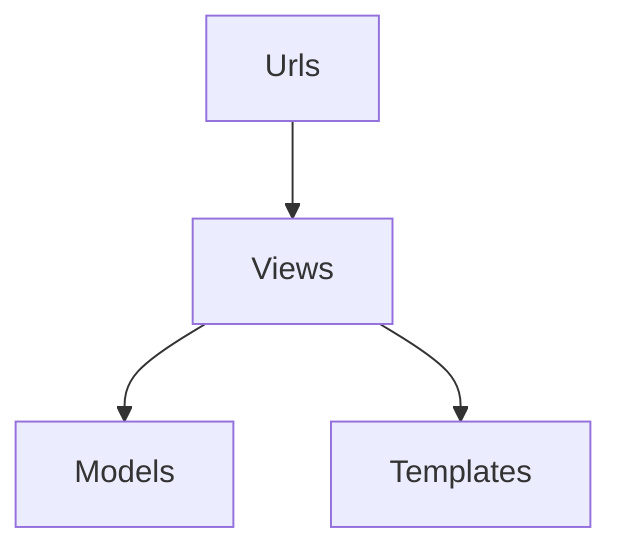

# network

Django Asosiy Ishlash Siximasi


<details>

<summary>DB DIOGRAMMALAR</summary>

## Django boshlang'ich Tushncha va diogrammalar
<details>

### User , Profile, RealitionSHip, Post, Commit va Liked models 
<summary>DB DIOGRAMMALAR</summary>
1-Model birinchi versiya


2-Model ikkinchi Versiya


</details>

<details>

<summary>Profile models</summary>


```python


import string
import random
from typing import Iterable
from django.db import models
from django.contrib.auth.models import User
from django.utils.text import slugify
from .utils import get_random_code
# Create your models here.


def rand_slug():
    return ''.join(random.choice(string.ascii_letters + string.digits) for _ in range(6))

class Profile(models.Model):
    last_name=models.CharField(max_length=150, blank=True)
    first_name=models.CharField(max_length=150, blank=True)
    bio=models.TextField(max_length=600, default="O\'zinggiz haqida ma\'lomot....")
    user=models.OneToOneField(User, on_delete=models.CASCADE)
    frinds=models.ManyToManyField(User, blank=True, related_name="frindes")
    email=models.EmailField(max_length=250, blank=True)
    avater=models.ImageField(default="avatar.png", upload_to="avatars/")
    country=models.CharField(max_length=120, default="Hi")
    slug=models.SlugField(blank=True)
    updated=models.DateTimeField(auto_now=True)
    created=models.DateTimeField(auto_now_add=True)
    
    def __str__(self):
        return f"{self.last_name}-{self.first_name}-{self.created}"
    def get_posts_number(self):
        return self.post_set.all().count()
    #foydalanovchi Postlari
    def get_authors_posts(self):
        return self.post_set.all()
    
    def get_likes_number(self):
        likes=self.like_set.all()
        total_like=0
        for item in likes:
            if item.value=="Like":
                total_like+=1
        return total_like
    def get_likes_recieved_number(self):
        post=self.post_set.all()
        total_like=0
        for item in post:
            total_like+=item.liked.all().count()
        return  total_like
                
    def save(self, *args, **kwargs) -> None:
        ew=None
        if self.first_name and self.first_name :
            to_slug=slugify(str(self.last_name).lower()+""+str(self.first_name)+""+str(get_random_code()))
            ew=Profile.objects.filter(slug=to_slug).exists()
            while ew:
                to_slug=slugify(str(rand_slug)+""+str(to_slug)+""+str(get_random_code()))
                ew=Profile.objects.filter(slug=to_slug).exists()
        else:
            to_slug=slugify(str(rand_slug)+""+str(get_random_code()))
        self.slug=to_slug
        return super().save(*args, **kwargs)

# Relation SHip model foydalanovchi obunalari va obunachilarini ushlab turovchi model
STATUS_CHOICES=(
    ("send", "send"),
    ("accepted", "accepted")
)
class RelationShip(models.Model):
    sender=models.ForeignKey(Profile, on_delete=models.CASCADE, related_name="sender")
    receiver=models.ForeignKey(Profile, on_delete=models.CASCADE, related_name="receiver")
    status=models.CharField(max_length=9, choices=STATUS_CHOICES)
    updated=models.DateTimeField(auto_now=True)
    created=models.DateTimeField(auto_now_add=True)
    
    def __str__(self) -> str:
        return f"{self.sender}-{self.receiver}-{self.status}"
    
    
    
    
   
```

</details>


<details>

<summary>Post , Commit va Like</summary>


```python


from django.db import models
from users.models import Profile
from django.core.validators import FileExtensionValidator

# Create your models here.

class Post(models.Model):
    title=models.CharField(max_length=250)
    content=models.TextField()
    image=models.ImageField(upload_to="post/",  validators=[FileExtensionValidator(allowed_extensions=['png','jpg','jpeg'])])
    liked=models.ManyToManyField(Profile, blank=True, related_name="liked")
    author=models.ForeignKey(Profile, on_delete=models.CASCADE, related_name='posts')
    post_updated=models.DateTimeField(auto_now=True)
    post_created=models.DateField(auto_now_add=True)
    
    
    def __str__(self):
        return self.title
    
    # get liked cound num 
    def get_liked(self):
        return self.liked.all().count()
    # get commit all count number 
    def get_commit_number(self):
        return self.comment_set.all().count()
    
    class Meta:
        ordering=['post_updated', "post_created"]
        
        
    
class Comment(models.Model):
    user=models.ForeignKey(Profile, on_delete=models.CASCADE)
    post=models.ForeignKey(Post, on_delete=models.CASCADE)
    body=models.TextField(max_length=500)
    updated=models.DateTimeField(auto_now=True)
    created=models.DateField(auto_now_add=True)
    
    def __str__(self):
        return str(self.pk)

LIKE_CHOICES=(
    ('Like', 'Like'),
    ('Unlike', 'Unlike')
)
class Like(models.Model):
    user=models.ForeignKey(Profile, on_delete=models.CASCADE)
    post=models.ForeignKey(Post, on_delete=models.CASCADE)
    value=models.CharField(choices=LIKE_CHOICES, max_length=8)
    updated=models.DateTimeField(auto_now=True)
    created=models.DateField(auto_now_add=True)
    
    def __str__(self) -> str:
        return f"{self.user}--{self.post}-{self.value}"


```

</details>
</details>

1-qadam
```bash
mkdir Network && cd Network
```
```bash
python3 -m venv myenvs
```
```bash
source myenvs/bin/activate
```
<a href="https://www.djangoproject.com/download/">Djangoni O'rnatish-></a>
```bash
pip install django
```
<a href="https://www.django-rest-framework.org/#installation">Django Rest Framework O'rnatish-></a>
```bash
pip install djangorestframework
```
<a href="https://pypi.org/project/django-dotenv/">Django Dotenvni O'rnatish-></a>
```bash
pip install django-dotenv
```


2-qadam
app nomli loyiha yaratamiz va ichiga kiramiz
```bash
django-admin startproject app && cd app
```
loyihani ishga tushirish
```bash
python3 manage.py runserver
```
Endi bizning loyihamiz ichida bir nechata ilovalar bulishi mumkin biz yangi **posts**, **comints** va **users** nomli ilovalar yaralamiz va settings.py ga qo'shamiz

```bash
python3 manage.py startapp posts
```
```bash

python3 manage.py startapp comints
```
```bash
python3 manage.py startapp users
```

Buni INSTALL_APPS ni tagidan yozib qo'yamiz
```python
INSTALL_APPS += [
    'users.apps.UsersConfig',
    'comint.apps.ComintConfig',
    'posts.apps.PostsConfig',
]
```
Yangi templates fileni yaratib install TEMPLATES ga ko'rsatib qo'yamiz
```python
BASE_DIR / 'templates'
```
STATIC_ROOT, STATICFILES_DIRS, MEDIA_ROOT vs MEDIA_URL larni settings.py ga qo'shaman

```python
STATIC_URL='static'
STATIC_ROOT = os.path.join(BASE_DIR, 'staticfiles')
STATICFILES_DIRS  = [
    os.path.join(BASE_DIR, 'static')
]

# media root va media url qo'shamiz
MEDIA_URL = 'media'
MEDIA_ROOT= os.path.join(BASE_DIR, 'media')
```
urls.py ga MEDIA VA STATIC FILELARNI KO'RSATAMIZ


```python
from django.urls import path, include
from django.contrib import admin
from django.conf import settings
from django.conf.urls.static import static

urlpatterns = [
    path("myadmin/", include(admin.site.templates)),
    path("", include('posts.urls')),
    path("comint/", include('comint.urls')),
    path("users/", include('users.urls')),
]

if setting.DEBUG:
    urlpatterns += static(settings.MEDIA_URL, doocument_root = settings.MEDIA_ROOT)
    urlpatterns += static(settings.STATIC_URL, doocument_root = settings.STATIC_ROOT)

```

urls.py nomli users, comint va posts ichidan oching.............

### <a href="https://tailwindcss.com/docs/installation/using-postcss">tailwind css</a> ni djangoga o'rnatamiz 
```bash
npm install -D tailwindcss postcss autoprefixer
```
```bash
npx tailwindcss init
```
**tailwind.config.js** ga qo'shing

```node
/** @type {import('tailwindcss').Config} */
module.exports = {
  content: [
    './app/templates/**/*.html',
  ],
  theme: {
    extend: {},
  },
  plugins: [],
};
```
Ildiz katalogingizda statik nomli katalog yarating. Ushbu katalog ichida src nomli boshqa katalog yarating va uning ichida input.css nomli fayl yarating. Input.css-ga quyidagi kodni qo'shing:

>static>src>input.css
```css
@tailwind base;
@tailwind components;
@tailwind utilities;

```
Package.json faylingizni ildiz katalogida toping va devDependencies obyektining yuqori qismiga quyidagi qatorni qo'shing:
```js
"scripts": {
    "dev": "npx tailwindcss -i ./static/src/input.css -o ./static/src/styles.css --watch"
  },

...

```
Agar Django loyihangiz ustida ishlayotganingizda sahifani qo‘lda qayta yuklash zerikarli bo‘lsa, server kodingiz, shablonlaringiz, kontentingiz yoki sinflaringiz o‘zgarganda sahifani avtomatik qayta yuklashni sozlashingiz mumkin. Buni qanday qilish kerak:

```bash
pip install django-browser-reload
```
setting.py
```python
INSTALLED_APPS = [
    ...,
    "django_browser_reload",
    ...,
]
MIDDLEWARE = [
    # ...
    "django_browser_reload.middleware.BrowserReloadMiddleware",
    # ...
]

```
urls.py
```python
from django.urls import include, path


urlpatterns = [
    ...,
    path("__reload__/", include("django_browser_reload.urls")),
]

```


## flowbite ni projectga o'rnatamiz
```bash
npm install flowbite
```

**tailwind.config.js** ga plugins joyga  require('flowbite/plugin') qo'shing
```js 
module.exports = {

    plugins: [
        require('flowbite/plugin')
    ]

}
```
va shu holatga kelishi kerak
```js
module.exports = {
  content: [
      './templates/**/*.html',
      './node_modules/flowbite/**/*.js'
  ],
  theme: {
    extend: {},
  },
  plugins: [
    require('flowbite/plugin')
],
}
```

va js ni 

_base.html ga ulang
```js
<script src="https://cdnjs.cloudflare.com/ajax/libs/flowbite/2.3.0/flowbite.min.js"></script>
```
yoki

